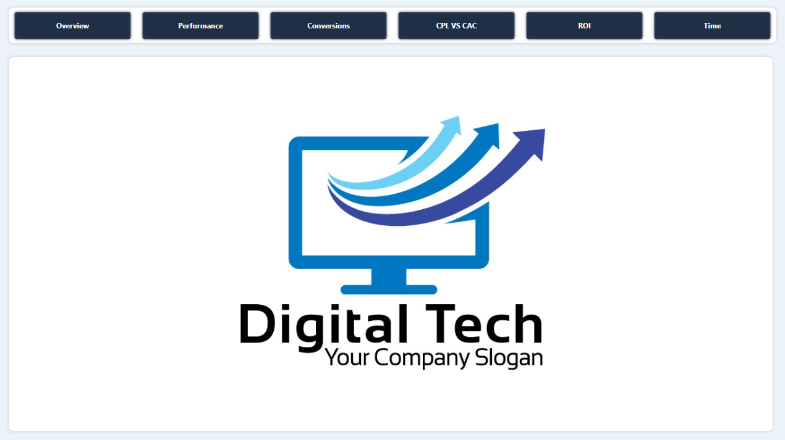
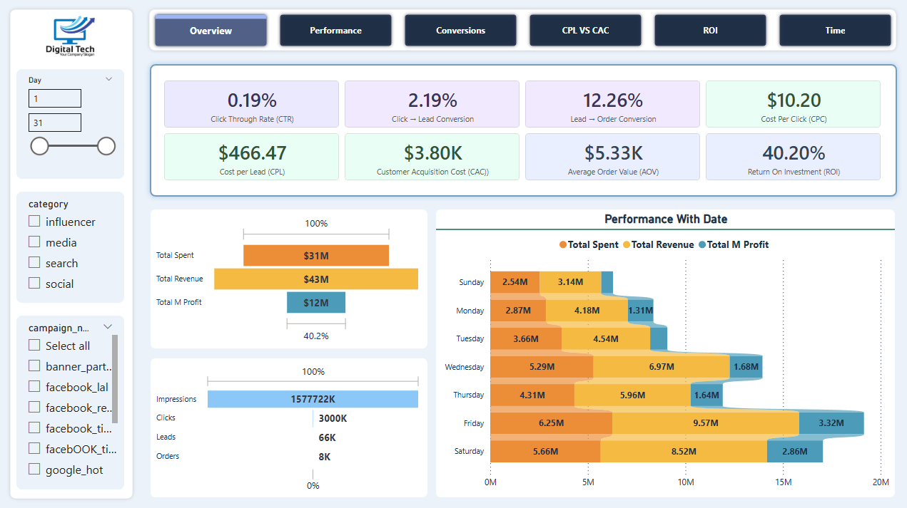
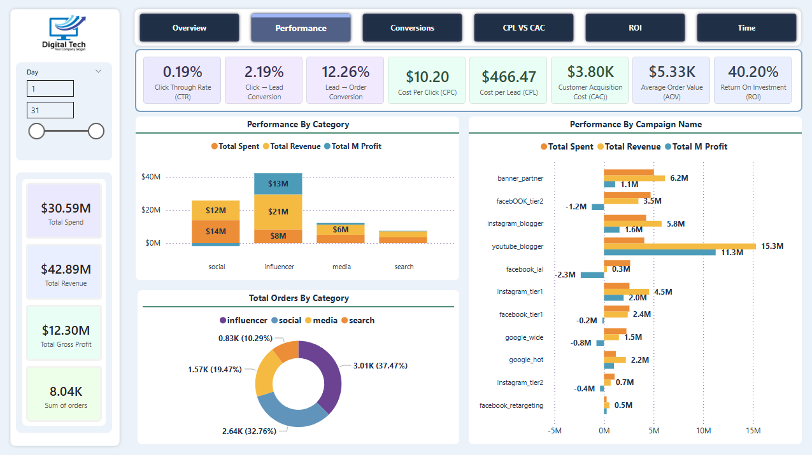
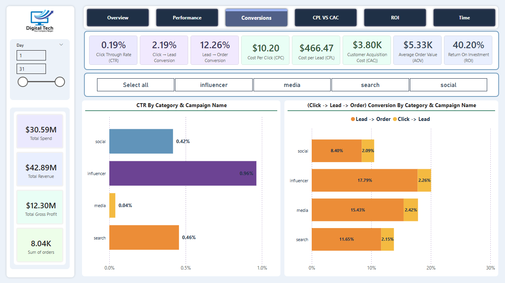
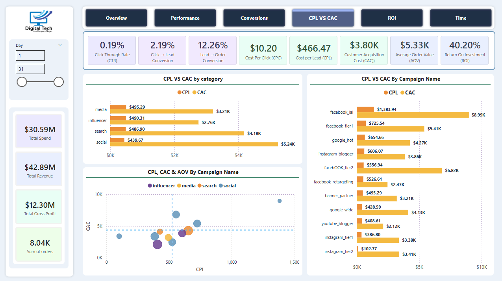
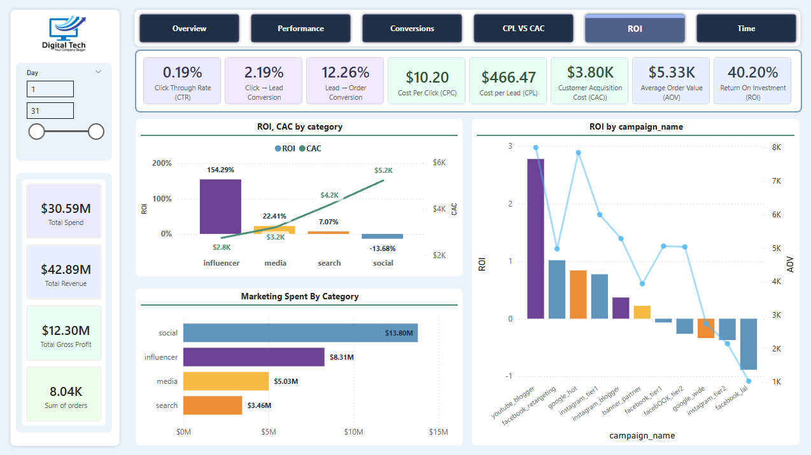
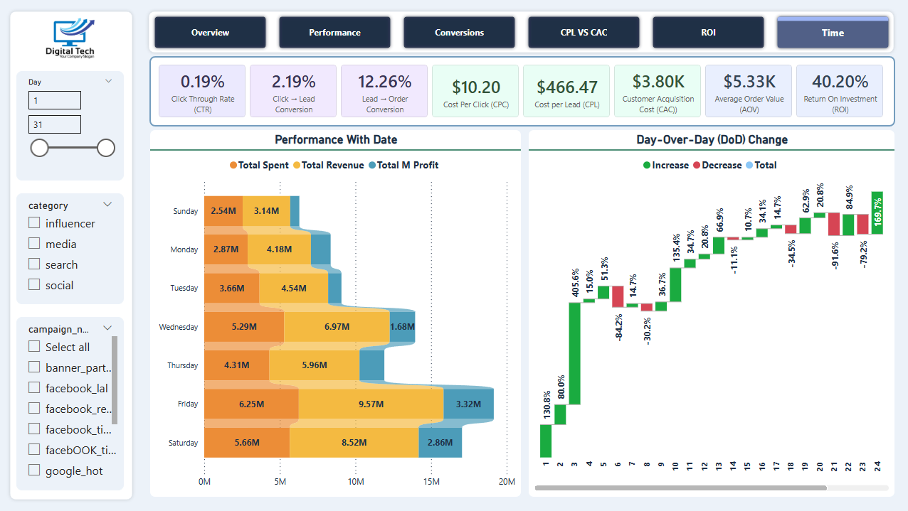

# Advertising Campaign Performance Analysis | Power BI

An end-to-end Power BI dashboard for analyzing digital advertising campaign performance across multiple channels and campaigns, focusing on profitability, efficiency, and conversion funnel optimization.

---

## 📊 Project Overview
This project analyzes advertising data to evaluate how marketing spend translates into clicks, leads, and orders.  
The dashboard helps marketing and business teams identify high-performing channels, inefficient campaigns, and optimization opportunities using clear KPIs and interactive visuals.

## 🎯 Key Objectives
- Measure overall marketing performance and ROI
- Analyze the full conversion funnel (Impressions → Clicks → Leads → Orders)
- Compare CPL vs CAC across categories and campaigns
- Identify top and low-performing campaigns
- Track performance trends over time

## 📌 Key KPIs
- Impressions, Clicks, Leads, Orders  
- CTR (Click Through Rate)  
- Click → Lead Conversion  
- Lead → Order Conversion  
- CPC (Cost Per Click)  
- CPL (Cost Per Lead)  
- CAC (Customer Acquisition Cost)  
- AOV (Average Order Value)  
- ROI (Return on Investment)

## 📈 Dashboard Highlights
- **Overview Page**: High-level performance metrics and revenue vs cost analysis  
- **Performance Analysis**: Spend, revenue, and profit by category and campaign  
- **Conversion Funnel**: Conversion rates by channel and campaign  
- **CPL vs CAC**: Cost efficiency analysis to detect unprofitable campaigns  
- **ROI Analysis**: ROI comparison across categories and individual campaigns  
- **Time Analysis**: Day-over-day performance and trend analysis  
---

## 🛠 Tools & Technologies
- Power BI  
- Power Query (ETL & Data Cleaning)  
- DAX (Measures & Calculations)  
- Data Modeling  
- Data Visualization & Storytelling  

## 📷 Dashboard Preview

| Page | ScreenShot |
|-----|---------------|
| 1 |
| 2 | 
| 3 | 
| 4 | 
| 5 | 
| 6 | 

## 📊 Live Power BI Dashboard

👉 Click  [here](https://app.powerbi.com/view?r=eyJrIjoiNTJmODdjOGUtZDgzZC00ZWVlLTliZWUtZjYwODY2ZTZkNjQxIiwidCI6ImU0MGU0YTI1LTY2MzgtNGE3MS05NTViLTgyZWI5MDYwMjBiMSJ9)  to view the interactive dashboard

## 👤 Author
**Osama Mohamed Abd El-Mohsen**  
Data Analyst  

GitHub: https://github.com/Osama-Abd-El-Mohsen  
Portfolio: https://www.osama-abd-elmohsen-portfolio.me  

---
